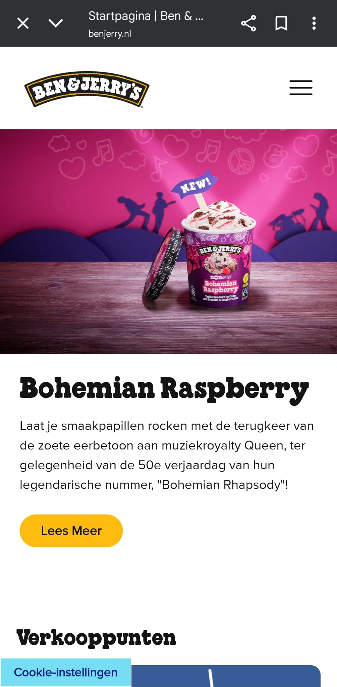
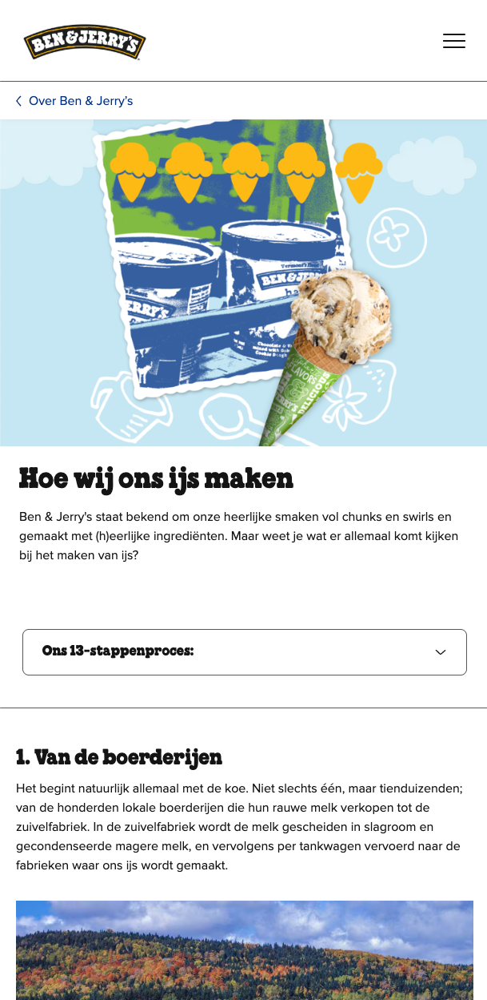
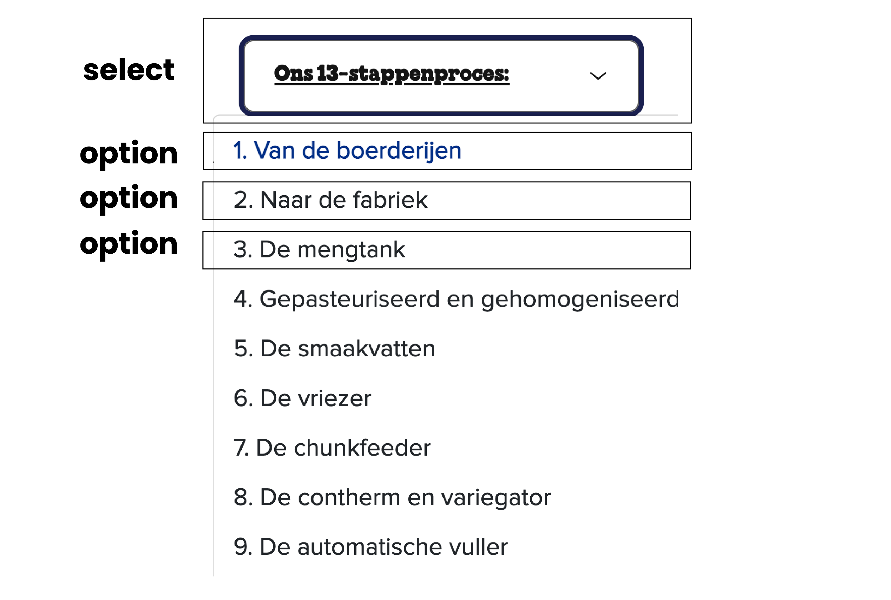

# Procesverslag
Markdown is een simpele manier om HTML te schrijven.  
Markdown cheat cheet: [Hulp bij het schrijven van Markdown](https://github.com/adam-p/markdown-here/wiki/Markdown-Cheatsheet).

Nb. De standaardstructuur en de spartaanse opmaak van de README.md zijn helemaal prima. Het gaat om de inhoud van je procesverslag. Besteedt de tijd voor pracht en praal aan je website.

Nb. Door *open* toe te voegen aan een *details* element kun je deze standaard open zetten. Fijn om dat steeds voor de relevante stuk(ken) te doen.

## Jij

  
uitwerken voor kick-off werkgroep

  ### Auteur:
  Joey Schouten

  #### Je startniveau:
  Rood?

  #### Je focus:
  Responsive
 

## Je website

  
uitwerken voor kick-off werkgroep

  ### Je opdracht:
  https://www.benjerry.nl/

  #### Screenshot(s) van de eerste pagina (small screen): 
  De homepagina van Ben&Jerry's.
  

  #### Screenshot(s) van de tweede pagina (small screen):
  De over ons pagina van Ben&Jerry's, hoe wij ons ijs maken. 
  
 

## Toegankelijkheidstest 1/2 (week 1)

  
uitwerken na test in 2e werkgroep

  ### Bevindingen
  Lijst met je bevindingen die in de test naar voren kwamen:

  Ten eerste: IK WORD GEK VAN DE VOICEOVER!!! OPEN HET NIET ALS JE IN EEN BESTAND ZIT MET ALLEMAAL CODE!!!

  -Het viel me als eerst op dat de voiceover heel erg snel praat. Alsof er een 2x speed op is gezet, gek genoeg is het soms best goed te volgen. Sommige teksten die B&J gebruikt hebben van die verticale streepjes (|) Dit is heel vervelend want hij spreekt dit ook uit als 'vertical line'. 
  -Ik kwam op de pagina terecht die een uitklapbaar menuutje heeft. Dit uitklapbaar menuutje genaamd: ???bnic_tabContainer.label.tabFilter???. Dit zegt mij niks. 
  -Hij gaf een melding waarbij de cookies niet geactiveerd waren. Dit werd benoemd als 'Alert'. Je kon wel gewoon verder door de pagina heen navigeren.
  -Hij kan ook geen teksten lezen. Hij gaat alleen maar naar buttons toe. 
  -Hij benoemt wanneer de link je naar een artikel brengt. Dit is handig, als je de tekst kan lezen.
  -Daarnaast wordt er ook benoemt of je de link al hebt bezocht.
  -De taal selectie dropdown menu heeft geen naam. Je weet dus niet wat deze dropdown menu inhoudt.

## Breakdownschets (week 1)

  
uitwerken na afloop 3e werkgroep

  ### de hele pagina: 
  

  ### dynamisch deel (bijv menu): 
  

  ### wellicht nog een dynamisch deel (bijv filter): 
  

## Voortgang 1 (week 2)

  
uitwerken voor 1e voortgang

  ### Stand van zaken
  HTML staat al helemaal klaar om opgemaakt te worden! Alles ging prima en heb al een paar nieuwe tags leren te gebruiken.

  ### Agenda voor meeting
  samen met je groepje opstellen

  | student 1      | student 2          | student 3    | student 4        |
  | ---            | ---                | ---          | ---              |
  | dit bespreken  | en dit             | en ik dit    | en dan ik dat    |
  | en dat ook nog | dit als er tijd is | nog een punt | dit wil ik zeker |
  | ...            | ...                | ...          | ...              |

  ### Verslag van meeting
  hier na afloop snel de uitkomsten van de meeting vastleggen

  - 2e HTML pagina bestond uit allemaal h1 tags ipv h2
  - punt 2
  - nog een punt
  - ...

## Voortgang 2 (week 3)

  
uitwerken voor 2e voortgang

  ### Stand van zaken
  Begonnen me de CSS. Eerste pagina is al bijna klaar op de header na. Het javascript gedeelte lukte nog niet helemaal lekker voor de header.

  ### Agenda voor meeting
  samen met je groepje opstellen

  | student 1      | student 2          | student 3    | student 4        |
  | ---            | ---                | ---          | ---              |
  | dit bespreken  | en dit             | en ik dit    | en dan ik dat    |
  | en dat ook nog | dit als er tijd is | nog een punt | dit wil ik zeker |
  | ...            | ...                | ...          | ...              |

  ### Verslag van meeting
  hier na afloop snel de uitkomsten van de meeting vastleggen

  - punt 1
  - punt 2
  - nog een punt
- ...

## Toegankelijkheidstest 2/2 (week 4)

  
uitwerken na test in 9e werkgroep

  ### Bevindingen
  De articles geven nog niet aan waar ze over gaan als je hovered over de meer lezen knoppen. Voiceover benoemt alleen nog maar de knop "Meer lezen", dit kan misschien nog verbetert worden met een alt tekstje. Ditzelfde geldt voor de social media icons.

De talen in de footer geven aan wat voor land het is, maar geeft niet aan dat het om talen gaat. Dit kan misschien ook nog verbeterd worden.

De 2e pagina drop down menu kan je niet door de opties heen tabben. 

## Voortgang 3 (week 4)

  
uitwerken voor 3e voortgang

  ### Stand van zaken
  Alles is zo goed als af. Alleen nog wat finishing touches. Ik ga thuis nog kijken of ik wat classes uit mijn code kan halen. 

  ### Agenda voor meeting
  samen met je groepje opstellen

  | student 1      | student 2          | student 3    | student 4        |
  | ---            | ---                | ---          | ---              |
  | dit bespreken  | en dit             | en ik dit    | en dan ik dat    |
  | en dat ook nog | dit als er tijd is | nog een punt | dit wil ik zeker |
  | ...            | ...                | ...          | ...              |

  ### Verslag van meeting
  hier na afloop snel de uitkomsten van de meeting vastleggen

  - Ik heb samen met Nienke nog gekeken hoe ik wat kleine probleempjes kon oplossen. 

## Eindgesprek (week 5)

  
uitwerken voor eindgesprek

  ### Je uitkomst - karakteristiek screenshots:
  

  ### Dit ging goed/Heb ik geleerd: 
  Korte omschrijving met plaatjes

  

  ### Dit was lastig/Is niet gelukt:
  Korte omschrijving met plaatjes

  

## Bronnenlijst

  
continu bijhouden terwijl je werkt

  Nb. Wees specifiek ('css-tricks' als bron is bijv. niet specifiek genoeg). 
  Nb. ChatGpT en andere AI horen er ook bij.
  Nb. Vermeld de bronnen ook in je code.

  1. bron 1
  2. bron 2
  3. ...

